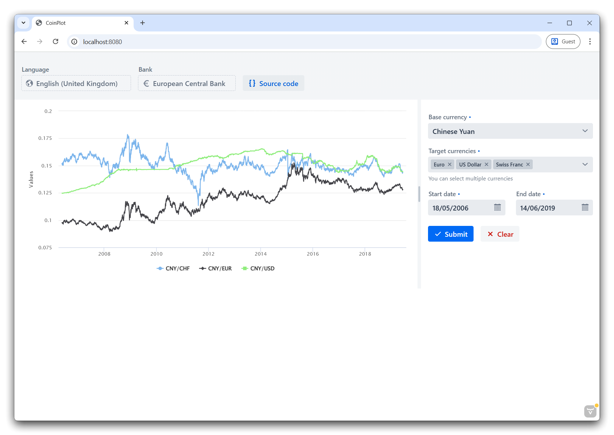

## About

**CoinPlot** is a simple and modern single-page web app for exchange rates visualization.



There are two versions of this project:

* `2.1.0` _(discontinued, has a separate branch in the repo)_
    * Far more focus on extensibility and architecture
    * Multiple exchange rate data providers
    * I18N and multi-language support
    * In-memory DB caching
    * [Lots of verbose code documentation](https://github.com/northmaxdev/coinplot/blob/2.x.x/src/main/java/io/github/northmaxdev/coinplot/lang/math/Percentage.java)
* `3.x.x` (`main` branch)
    * Is all about KISS - significantly leaner codebase with a clearer vision
    * Optimized for a single exchange rate data provider and a single locale
    * Probably far more performant (both speed and memory)

> [!NOTE]
> Starting with version `3.0.0`, i18n is dropped completely in favor of just `en_GB` (the closest standard equivalent to Microsoft's `English (International)` locale). This is to ensure UI consistency as not all UI components are documented well-enough for i18n...

> [!WARNING]
> This web app was not tested for mobile screens.

> [!WARNING]
> This app and its developer(s) bear no responsibility regarding what the user ends up doing with their money when they use this app.

> [!TIP]
> 1. This project wouldn't exist without the [Frankfurter API](https://frankfurter.dev/) - all other exchange rate APIs are paid for and/or a headache. Consider supporting [the project](https://github.com/lineofflight/frankfurter) and [its developer](https://github.com/hakanensari) ❤️ 
> 2. The Frankfurter API can be self-hosted, and this app supports that. Simply change the API URI in the [Spring application properties file](src/main/resources/application.properties).

## TODO
* [ ] Do all the in-code `TODO`'s
* [ ] Migrate to Spring Boot 4
* [ ] Migrate to Vaadin 25 & Aura theme
* [ ] Profile and compare performance between `2.1.0` and `3.x.x`
* [ ] Compare LoC count between `2.1.0` and `3.x.x` (could be an interesting statistic in addition to profiling results)
* [ ] A prettier screenshot (preferably on macOS)

## Build & run

1. Ensure you have JDK 25 setup, including `JAVA_HOME`. You may download one from the [Adoptium](https://adoptium.net/) project,
   or your local package manager. Or just ask ChatGPT, as always...

2. Run the following commands:

   **Linux & macOS**
   ```shell
   git clone https://github.com/northmaxdev/coinplot.git # clone the repo
   cd coinplot # go into the cloned repo
   ./mvnw package -Pproduction # build a self-contained JAR file (this might take a few minutes)
   java -jar ./target/coinplot-3.1.0.jar # run the JAR file on the JRE
   ```
   
   **Microsoft Windows**
   ```shell
   git clone https://github.com/northmaxdev/coinplot.git # clone the repo
   cd coinplot # go into the cloned repo
   .\mvnw.cmd package -Pproduction # build a self-contained JAR file (this might take a few minutes)
   java -jar .\target\coinplot-3.1.0-dev.jar # run the JAR file on the JRE
   ```

   The resulting JAR file should be fully self-contained and can be copied and ran in any environment where JRE 25 is set up.

## Licensing

[MIT license.](LICENSE)
